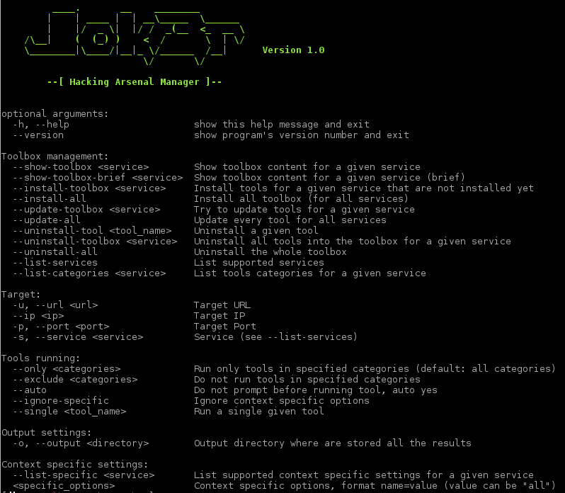

Jok3r
====


Description
----
Jok3r is a python CLI application which is aimed at simplifying first phases of network infrastructure and web penetration testing.

It provides the following features:
* Manage toolbox (install & update), organized by service ;
* Automatically run tools from the toolbox against a specific service for a given target ;
* Handle context specific options for tools, based on the target.

Supported targeted services, tools, commands, specific options are all fully customisable by editing the configuration files.


Requirements
----
It is recommended that Kali Linux is used as it already has tools like Metasploit (msfconsole) and Nmap installed, however Jok3r will work on any Debian-based systems. It is just necessary to make sure those tools are manually installed to be able to run some of the commands from config files.

Language: Python 2.7


Installation
----
Installation is pretty straightforward:

* Clone the repository to get the latest Jok3r source code:
```bash
git clone https://github.com/koutto/jok3r.git
```

* Install required python libraries:
```bash
cd jok3r/
pip install -r requirements.txt
```

* Everything should be ok, try to display the help:
```bash
python jok3r.py -h
```

Here is a screenshot of the help message:



First usage
----
First thing to do is to install the toolbox for each service. To do so, there are 2 possibilities:

* Install toolbox for each service separately ; it might be useful if you plan to use Jok3r just to target some services, and do not need to install the whole toolbox:
```bash
python jok3r.py --install-toolbox <service>
```

* If you want to install all the tools parametered in *.conf files, just run the following command:
```bash
python jok3r.py --install-all
```

Note: Toolbox installation process is interactive, it enables users to confirm the installation of each tool, but also to make sure that tools have been correctly installed (by trying to run them just after their installation).

Then, toolbox status can be checked using following commands:
```bash
python jok3r.py --show-toolbox <service>
```
or
```bash
python jok3r.py --show-toolbox-brief <service>
```

Toolbox Management
----
The toolbox installation process has been described in previous section.
Jok3r is also useful to keep all the tools updated, via following commands:

* To update the whole toolbox (going through all *.conf files):
```bash
python jok3r.py --update-all
```

* To update only the tools targeting a specific service (going through only the corresponding .conf file):
```bash
python jok3r.py --update-toolbox <service>
```

Tools uninstallation is also handled, via following commands:
* To uninstall a given tool:
```bash
python jok3r.py --uninstall-tool <tool_name>
```

* To uninstall the tools targeting a specific service:
```bash
python jok3r.py --uninstall-toolbox <service>
```

* To clean everything:
```bash
python jok3r.py --uninstall-all
```

Tree structure
----
The project is structured in folders as such:

* [lib] - Contains the source code
  * [controller] - The controller interface between the cli and the logic (based on MVC design)
  * [core] - Contains the core classes of the project which handles the logic of the app 
  * [output] - Contains classes used for CLI output
  * [utils] - Contains utility classes
* [output] - Default directory where results are stored
* [pictures] - Logo and images
* [settings] - Contains configuration files. One .conf file per service. Easily editable
* [toolbox] - Directory where the tools are installed.  
  * [service_name] - For each service, a sub-directory is created when installing toolbox
    * [category_01] - For a given service, a sub-directory is created for each category as described into the corresponding .conf file
    * [category_02]
  * ...
* [wordlists] - Default wordlists aimed at being used by some tools
* README.txt - This file
* requirements.txt - Pip requirements file (required Python libraries)
* jok3r.py - The main program. This is the script that the user needs to run.


Configuration files
----
There is one configuration file (.conf) per supported service. There are all stored inside the "settings" directory.
**Testers can easily edit the content of the existing files in order to add/remove some tools and/or to update the commands. Furthermore, they also can add configuration files for new services.**

The syntax of a configuration file is described below (remember, 1 configuration file = 1 service):

* **[general] section - General settings**:
  * _tools_categories_ - mandatory setting - contains the list of categories for the tools configured in the current .conf file.
  * _<specific>_list_ - optional setting - .

* **Tool section**:
  * General tool settings:
    * _name_ - mandatory setting - Name of the tool as it will appear in the program
    * _category_ - mandatory setting - Name of the category to which the tool belong. Must be one of the categories in the setting _tools_categories_.
    * _description_ - mandatory setting - Short description for the tool.
    * _command_ - mandatory setting - Command-line used to run the tool (see supported tags that can be used).
    * _install_ - optional setting - Command-line used to install the tool (if possible with all dependencies installation). This setting is not always set, e.g. for tools that are supposed to be already installed on the system (like Nmap or Metasploit).
    * _update_ - optional setting - Command-line used to update the tool.
    * _last_update_ - optional setting - Date of the last tool update. Value auto-updated by Jok3r.
    * _installed_ - Indicated whether the tool is installed or not. Value auto-updated by Jok3r.
  * Context-specific tool settings:
    * <specific>_specific - optional setting - Context-specific settings can be used in order to specify that a tool should be run against the target ONLY in some circumstances, i.e. only when one specific option (passed on the command-line when running Jok3r) is set with a given value.

The setting _command_ supports the use of several tags ; they are replaced by the correct values at runtime:
* _[URL]_ - The target URL (when target service is HTTP)
* _[HOST]_ - The target hostname
* _[IP]_ - The target IP address (in case of load balancing, first IP is taken)
* _[PORT]_ - Target port number (TCP or UDP, depending on the target service)
* _[PROTOCOL]_ - Protocol, either TCP or UDP
* _[SERVICE]_ - Target service name
* _[OUTPUT]_ - Output file for the command. If it is not specified into the command, Jok3r will automatically make sure to log the output of the tool
* _[OUTPUTDIR]_ - Output directory for the tools that save their results into several files.
* Context-specific tags:
  * For boolean options: _[OPTIONNAME option="value"]_ - If the setting _optionname_specific = True_ is specified for the tool, the string written as _value_ will be inserted into the command-line at the tag location.
  * For list-member options: _[OPTIONNAME name1="value1" name2="value2" ... ]_ - If the setting _optionname_specific = name2_ is specified for the tool (for example), the string written as _value2_ will be inserted into the command-line at the tag location.
 
The settings _install_ and _update_ both support the use of the following tag:
* _[TOOLBOXDIR]_ - Toolbox directory, by default "toolbox/"
