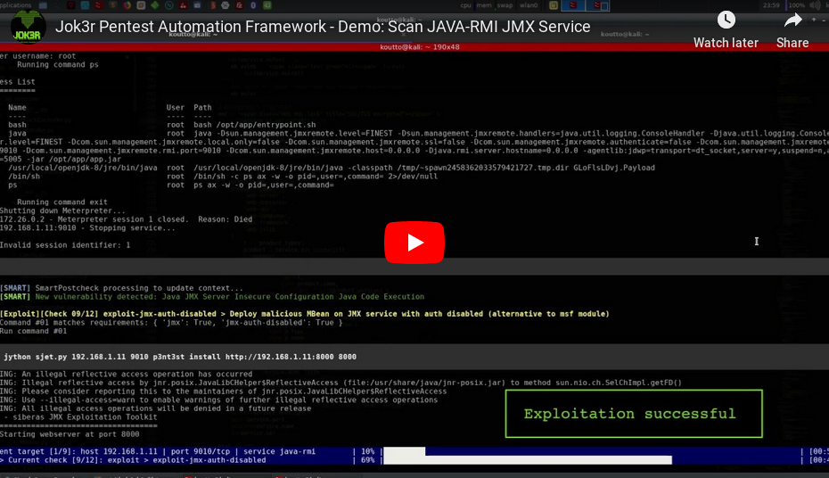
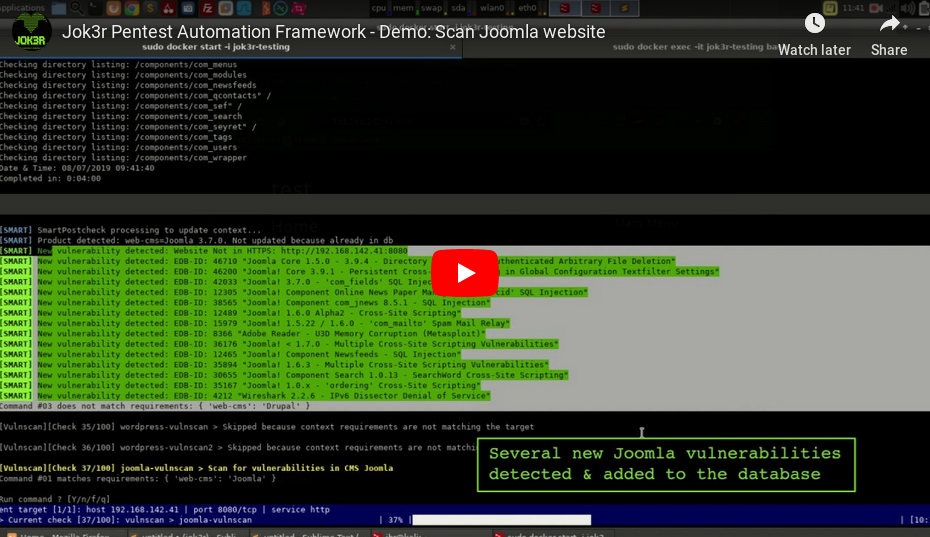
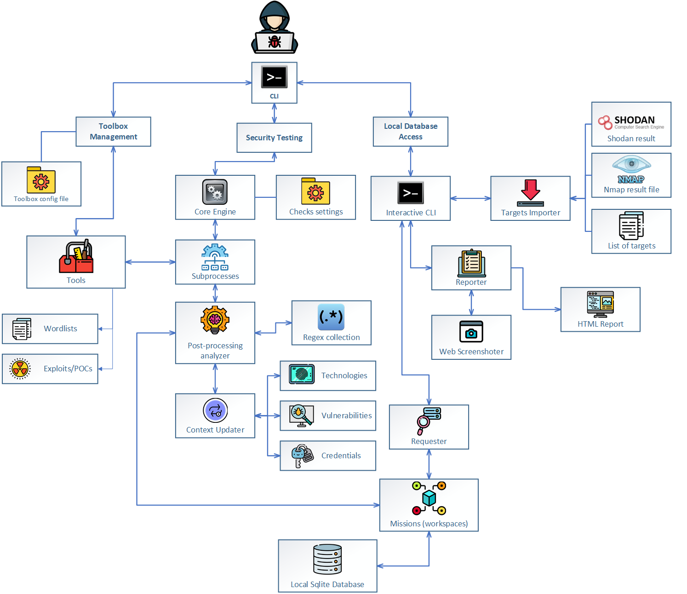
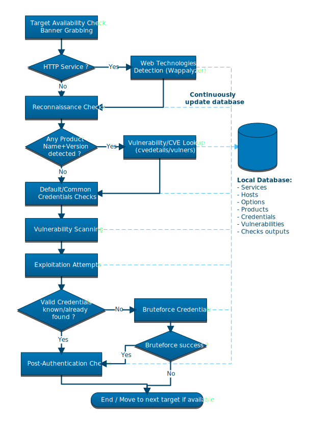

.. raw:: html

   <h1 align="center">

.. image:: https://i.imgur.com/q6Ln3nM.png

.. raw:: html

    
   Jok3r v3 Alpha Arch, Arch GNU/Linux Variant.
    

.. image:: https://img.shields.io/badge/python-3.6-blue.svg
    :target: https://www.python.org/downloads/release/python-366/
    :alt: Python 3.6

.. image:: https://readthedocs.org/projects/jok3r/badge/?version=latest
   :target: https://jok3r.readthedocs.io/en/latest/
   :alt: Documentation ReadTheDocs

.. raw:: html

   </h1>
   <h3 align="center">Network & Web Pentest Automation Framework</h3>
   
<a href="https://www.jok3r-framework.com/">www.jok3r-framework.com</a>

**WARNING: Project is still in version 3 BETA. It is still under active development 
and bugs might be present.**

**Many tests are going on: see https://github.com/koutto/jok3r/blob/master/tests/TESTS.rst. 
Ideas, bug reports, contributions are welcome !**

.. contents:: 
    :local:
    :depth: 1

=============
Overview
=============
*Jok3r* is a Python3 CLI application which is aimed at **helping penetration testers 
for network infrastructure and web black-box security tests**. 

The goal is to save as much time as possible during network/web pentests by automating as 
many security tests as possible in order to quickly identify low-hanging fruits vulnerabilities, and 
then spend more time on more interesting and tricky stuff !

It is based upon the observation that there are many hacking open-source tools/scripts  (from various sources)
targeting common network services available out there, that allow to perform various tasks from
fingerprinting to exploitation. Therefore, the idea of *Jok3r* is to combine those open-source tools 
in a smart way to get the more relevant results.

=============
Features
=============

Pentest Toolbox management
--------------------------
* **Selection of Tools**: Compilation of 50+ open-source tools & scripts, from various sources.
* **Docker-based**: Application packaged in a Docker image running Kali OS, available on Docker Hub.
* **Ready-to-use**: All tools and dependencies installed, just pull the Docker image and run a fresh container.
* **Updates made easy**: Easily keep the whole toolbox up-to-date by running only one command.
* **Easy Customization**: Easily add/remove tools from a simple configuration file.

Network Infrastructure Security Assessment
------------------------------------------
* **Many supported Services**: Target most common TCP/UDP services (HTTP, FTP, SSH, SMB, Oracle, MS-SQL, MySQL, PostgreSQL, VNC, etc.).
* **Combine Power of Tools**: Each security check is performed by a tool from the toolbox. Attacks are performed by chaining security checks.
* **Context Awareness**: Security checks to run are selected and adapted according to the context of the target (i.e. detected technologies, credentials, vulnerabilities, etc.).
* **Reconnaissance**: Automatic fingerprinting (product detection) of targeted services is performed.
* **CVE Lookup**: When product names and their versions are detected, a vulnerability lookup is performed on online CVE databases (using Vulners & CVE Details).
* **Vulnerability Scanning**: Automatically check for common vulnerabilities and attempt to perform some exploitations (auto-pwn).
* **Brute-force Attack**: Automatically check for default/common credentials on the service and perform dictionnary attack if necessary. Wordlists are optimized according to the targeted services.
* **Post-authentication Testing**: Automatically perform some post-exploitation checks when valid credentials have been found.

Web Security Assessment
-----------------------
* **Large Focus on HTTP**: More than 60 different security checks targeting HTTP supported for now.
* **Web Technologies Detection**: Fingerprinting engine based on Wappalyzer is run prior to security checks, allowing to detect: Programming language, Framework, JS library, CMS, Web & Application Server.
* **Server Exploitation**: Automatically scan and/or exploit most critical vulnerabilities (e.g. RCE) on web and application servers (e.g. JBoss, Tomcat, Weblogic, Websphere, Jenkins, etc.).
* **CMS Vulnerability Scanning**: Automatically run vulnerability scanners on most common CMS (Wordpress, Drupal, Joomla, etc.).

Local Database & Reporting
--------------------------
* **Local Database**: Data related to targets is organized by missions (workspaces) into a local Sqlite database that is kept updated during security testings.
* **Metasploit-like Interactive Shell**: Access the database through an interactive shell with several built-in commands.
* **Import Targets from Nmap**: Add targets to a mission either manually or by loading Nmap results.
* **Import Targets from Shodan**: Add targets to a mission manually from shodan (need shodan API key).
* **Access all Results**: All outputs from security checks, detected credentials and vulnerabilities are stored into the database and can be accessed easily.
* **Reporting**: Generate full HTML reports with targets summary, web screenshots and all results from security testing.

============
Demos
============

* **Example 1: Scan a JAVA-RMI (JMX) service:** 

* **Example 2: Scan a Joomla website:** 

============
Architecture
============

============
Installation
============
**IMPORTANT: The recommended way to use Jok3r is by pulling the Docker Image so you will not have 
to worry about dependencies issues and installing the various hacking tools of the toolbox.
Everything is tested from the Docker container available on Docker Hub !**

.. image:: https://raw.githubusercontent.com/koutto/jok3r/master/pictures/docker-logo.png

A Docker image is available on Docker Hub and automatically re-built at each update: 
https://hub.docker.com/r/koutto/jok3r/. It is initially based on official Kali
Linux Docker image (kalilinux/kali-linux-docker).

.. image:: https://images.microbadger.com/badges/image/koutto/jok3r.svg
   :target: https://microbadger.com/images/koutto/jok3r
   :alt: Docker Image size

1. **Pull Jok3r Docker Image:**

    .. code-block:: console

        sudo docker pull koutto/jok3r

2. **Run fresh Docker container:**

    .. code-block:: console

        sudo docker run -i -t --name jok3r-container -w /root/jok3r -e DISPLAY=$DISPLAY -v /tmp/.X11-unix:/tmp/.X11-unix --shm-size 2g --net=host koutto/jok3r

Notes:

* ``-e DISPLAY=$DISPLAY -v /tmp/.X11-unix:/tmp/.X11-unix`` is required in order to be able to start GUI applicationfrom the Docker container (e.g. open web browser to read reports). It requires running ``xhost +local:root`` on the host.

* ``--shm-size 2g`` is used to increase the size of the shared memory, it is required to avoid crashs of web browser when reading reports from the Docker container.

* ``--net=host`` is required to share host's interface. It is needed for reverse connections (e.g. Ping to container when testing for RCE, Getting a reverse shell)

3. **To re-run a stopped container:**

    .. code-block:: console

        sudo docker start -i jok3r-container

4. **To open multiple shells inside the container:**

    .. code-block:: console

        sudo docker exec -it jok3r-container bash

============
Update
============

**In order to update, just pull the latest Docker Image from Docker Hub and run a fresh container from this new image:**

.. code-block:: console

    sudo docker pull koutto/jok3r
    sudo docker run -i -t --name jok3r-container-updated -w /root/jok3r -e DISPLAY=$DISPLAY -v /tmp/.X11-unix:/tmp/.X11-unix --shm-size 2g --net=host koutto/jok3r

Note: Of course, you can retrieve your local database ``local.db`` (with your saved missions, targets...) from an old container by using the command ``sudo docker cp``.

====================
Quick usage examples
====================

Pentest Toolbox management
--------------------------

* Show all the tools in the toolbox:

.. code-block:: console

    python3 jok3r.py toolbox --show-all

* Install all the tools in the toolbox (already done in Docker container):

.. code-block:: console

    python3 jok3r.py toolbox --install-all --auto

* Update all the tools in the toolbox and prompt each time to check update:

.. code-block:: console

    python3 jok3r.py toolbox --update-all

* Update all the tools in the toolbox without any prompt:

.. code-block:: console

    python3 jok3r.py toolbox --update-all --auto

Information
-----------

* List supported services:

.. code-block:: console

    python3 jok3r.py info --services

* Show security checks for a given service:

.. code-block:: console

    python3 jok3r.py info --checks <service>

* Show supported attack profiles for a given service:

.. code-block:: console

    python3 jok3r.py info --attack-profiles <service>

* Show supported products for all services:

.. code-block:: console

    python3 jok3r.py info --products

Security Testing
----------------

Create a new mission in local database:

.. code-block:: console

    python3 jok3r.py db

    jok3rdb[default]> mission -a mayhem

    [+] Mission "mayhem" successfully added
    [*] Selected mission is now mayhem

    jok3rdb[mayhem]> 

**Single target:** 

* Run all security checks against an URL in interactive mode and add results to the "mayhem" mission:

.. code-block:: console

    python3 jok3r.py attack -t https://www.example.com/ --add2db mayhem

* Run security checks against a MS-SQL service (without user-interaction) and add results to the mission:

.. code-block:: console

    python3 jok3r.py attack -t 192.168.1.42:1433 -s mssql --add2db mayhem --fast

* Run only "recon" and "vulnscan" security checks against an FTP service and add results to the mission:

.. code-block:: console

    python3 jok3r.py attack -t 192.168.1.142:21 -s ftp --cat-only recon,vulnscan --add2db mayhem

**Multiple targets:** 

* Search only for "easy wins" (critical vulns & easy to exploit) on all services registered in mission "mayhem":

.. code-block:: console

    python3 jok3r.py attack -m mayhem --profile red-team --fast

* Run all security checks against all services in the given mission and store results in the database:

.. code-block:: console

    python3 jok3r.py attack -m mayhem --fast

* Run security checks against only FTP services running on ports 21/tcp and 2121/tcp from the mission:

.. code-block:: console

    python3 jok3r.py attack -m mayhem -f "port=21,2121;service=ftp" --fast

* Run security checks against only FTP services running on ports 2121/tcp and all HTTP services on 192.168.1.42 from the mission:

.. code-block:: console

    python3 jok3r.py attack -m mayhem -f "port=2121;service=ftp" -f "ip=192.168.1.42;service=http"

Database Access & Reporting
---------------------------

* Select a mission:

.. code-block:: console

    python3 jok3r.py db

    jok3rdb[default]> mission mayhem

    [*] Selected mission is now mayhem

* Import hosts/services from Nmap results (XML) into the mission scope:

.. code-block:: console

    jok3rdb[mayhem]> nmap results.xml

* Import hosts/services from Shodan results (ip) into the mission scope:

.. code-block:: console

    jok3rdb[mayhem]> shodan ip

* Display services, hosts, detected products & credentials registered in selected mission:

.. code-block:: console

    jok3rdb[mayhem]> services
    jok3rdb[mayhem]> hosts
    jok3rdb[mayhem]> products
    jok3rdb[mayhem]> creds

* Search for string in checks results in selected mission:

.. code-block:: console

    jok3rdb[mayhem]> results --search '<search_string>'

* Display vulnerabilities automatically detected from checks outputs in selected mission (experimental):

.. code-block:: console

    jok3rdb[mayhem]> vulns

* Generate HTML report for the selected mission:

.. code-block:: console

    jok3rdb[mayhem]> report

======================
Typical usage example
======================

You begin a pentest with several servers in the scope. Here is a typical example of usage of *JoK3r*:

1. You run *Nmap* scan on the servers in the scope.

2. You create a new mission (let's say "mayhem") in the local database:

.. code-block:: console

    python3 jok3r.py db

    jok3rdb[default]> mission -a mayhem

    [+] Mission "mayhem" successfully added
    [*] Selected mission is now mayhem

    jok3rdb[mayhem]> 

3. You import your results from *Nmap* scan in the database:

.. code-block:: console

    jok3rdb[mayhem]> nmap results.xml

4. You can then have a quick overview of all services and hosts in the scope, add some comments, add
   some credentials if you already have some knowledge about the targets (grey box pentest), and so on.

.. code-block:: console

    jok3rdb[mayhem]> hosts

    [...]

    jok3rdb[mayhem]> services

    [...]

5. Now, you can run security checks against some targets in the scope. For example, if you 
   want to run checks against all Java-RMI services in the scope, you can run the following command:

.. code-block:: console

    python3 jok3r.py attack -m mayhem -f "service=java-rmi" --fast

6. You can view the full results from the security checks either in live when the tools are 
   executed or later from the database using the following command:

.. code-block:: console

    jok3rdb[mayhem]> results

7. At any moment, it is possible to display data automatically extracted from security checks outputs, i.e.
   detected products, credentials & vulnerabilities.

.. code-block:: console

    jok3rdb[mayhem]> products

    [...]

    jok3rdb[mayhem]> creds

    [...]

    jok3rdb[mayhem]> vulns

    [...]

8. At any moment, you can generate an HTML report with a summary of all targets in the mission scope, screenshots
   of web pages for HTTP services and full outputs of all security checks that have been run:

.. code-block:: console

    jok3rdb[mayhem]> report

==================
Full Documentation
==================
Documentation writing in progress...

=====================================
Supported Services & Security Checks 
=====================================

**Updated on: 12/07/2019**

**Lots of checks remain to be implemented and services must be added !! Work in progress ...**

-  `AJP (default 8009/tcp)`_
-  `FTP (default 21/tcp)`_
-  `HTTP (default 80/tcp)`_
-  `Java-RMI (default 1099/tcp)`_
-  `JDWP (default 9000/tcp)`_
-  `MSSQL (default 1433/tcp)`_
-  `MySQL (default 3306/tcp)`_
-  `Oracle (default 1521/tcp)`_
-  `PostgreSQL (default 5432/tcp)`_
-  `RDP (default 3389/tcp)`_
-  `SMB (default 445/tcp)`_
-  `SMTP (default 25/tcp)`_
-  `SNMP (default 161/udp)`_
-  `SSH (default 22/tcp)`_
-  `Telnet (default 21/tcp)`_
-  `VNC (default 5900/tcp)`_

AJP (default 8009/tcp)
----------------------

.. code-block:: console

    +------------------------+--------------+--------------------------------------------------------------------------+-------------------+
    | Name                   | Category     | Description                                                              | Tool used         |
    +------------------------+--------------+--------------------------------------------------------------------------+-------------------+
    | nmap-recon             | recon        | Recon using Nmap AJP scripts                                             | nmap              |
    | tomcat-version         | recon        | Fingerprint Tomcat version through AJP                                   | ajpy              |
    | vulners-lookup         | vulnlookup   | Vulnerabilities lookup on Vulners.com (requires product name+version)    | vulners-lookup    |
    | cvedetails-lookup      | vulnlookup   | Vulnerabilities lookup on Cvedetails.com (requires product name+version) | cvedetails-lookup |
    | default-creds-tomcat   | defaultcreds | Check default credentials for Tomcat Application Manager through AJP     | ajpy              |
    | deploy-webshell-tomcat | exploit      | Deploy a webshell on Tomcat through AJP and list applications            | ajpy              |
    +------------------------+--------------+--------------------------------------------------------------------------+-------------------+

FTP (default 21/tcp)
--------------------

.. code-block:: console

    +-------------------+--------------+--------------------------------------------------------------------------+-------------------+
    | Name              | Category     | Description                                                              | Tool used         |
    +-------------------+--------------+--------------------------------------------------------------------------+-------------------+
    | nmap-recon        | recon        | Recon using Nmap FTP scripts                                             | nmap              |
    | ftpmap-scan       | vulnscan     | Identify FTP server soft/version and check for known vulns               | ftpmap            |
    | vulners-lookup    | vulnlookup   | Vulnerabilities lookup on Vulners.com (requires product name+version)    | vulners-lookup    |
    | cvedetails-lookup | vulnlookup   | Vulnerabilities lookup on Cvedetails.com (requires product name+version) | cvedetails-lookup |
    | default-creds     | defaultcreds | Check default/common credentials on FTP server                           | hydra             |
    | bruteforce-creds  | bruteforce   | Bruteforce FTP accounts                                                  | hydra             |
    | ftp-dirlisting    | postexploit  | List directories/files on FTP server (maxdepth=4)                        | lftp              |
    +-------------------+--------------+--------------------------------------------------------------------------+-------------------+

HTTP (default 80/tcp)
---------------------

.. code-block:: console

    +------------------------------------------+--------------+------------------------------------------------------------------------------------------------+-------------------------------+
    | Name                                     | Category     | Description                                                                                    | Tool used                     |
    +------------------------------------------+--------------+------------------------------------------------------------------------------------------------+-------------------------------+
    | nmap-recon                               | recon        | Recon using Nmap HTTP scripts                                                                  | nmap                          |
    | load-balancing-detection                 | recon        | HTTP load balancer detection                                                                   | halberd                       |
    | waf-detection                            | recon        | Identify and fingerprint WAF products protecting website                                       | wafw00f                       |
    | waf-detection2                           | recon        | Identify and fingerprint WAF products protecting website                                       | identifywaf                   |
    | cloudmare-recon                          | recon        | CloudFlare real IP catcher                                                                     | cloudmare                     |
    | fingerprinting-multi-whatweb             | recon        | Identify CMS, blogging platforms, JS libraries, Web servers                                    | whatweb                       |
    | fingerprinting-appserver                 | recon        | Fingerprint application server (JBoss, ColdFusion, Weblogic, Tomcat, Railo, Axis2, Glassfish)  | clusterd                      |
    | webdav-detection-msf                     | recon        | Detect WebDAV on webserver                                                                     | metasploit                    |
    | fingerprinting-multi-wig                 | recon        | Fingerprint several CMS and web/application servers                                            | wig                           |
    | fingerprinting-cms-cmseek                | recon        | Detect CMS (130+ supported), detect version on Drupal, advanced scan on Wordpress/Joomla       | cmseek                        |
    | fingerprinting-cms-fingerprinter         | recon        | Fingerprint precisely CMS versions (based on files checksums)                                  | fingerprinter                 |
    | fingerprinting-drupal                    | recon        | Fingerprint Drupal 7/8: users, nodes, default files, modules, themes enumeration               | drupwn                        |
    | fingerprinting-domino                    | recon        | Fingerprint IBM/Lotus Domino software                                                          | domiowned                     |
    | crawling-fast                            | recon        | Crawl website quickly, analyze interesting files/directories                                   | dirhunt                       |
    | crawling-fast2                           | recon        | Crawl website and extract URLs, files, intel & endpoints                                       | photon                        |
    | vulners-lookup                           | vulnlookup   | Vulnerabilities lookup (language, framework, jslib, cms, server, appserver) on Vulners.com     | vulners-lookup                |
    | cvedetails-lookup                        | vulnlookup   | Vulnerabilities lookup (language, framework, jslib, cms, server, appserver) on Cvedetails.com  | cvedetails-lookup             |
    | default-creds-web-multi                  | defaultcreds | Check for default credentials on various web interfaces                                        | changeme                      |
    | default-creds-appserver                  | defaultcreds | Check for default/common credentials on appservers                                             | web-brutator                  |
    | ssl-check                                | vulnscan     | Check for SSL/TLS configuration                                                                | testssl                       |
    | headers-analysis                         | vulnscan     | Check HTTP headers                                                                             | h2t                           |
    | vulnscan-multi-nikto                     | vulnscan     | Check for multiple web vulnerabilities/misconfigurations                                       | nikto                         |
    | webdav-scan-davscan                      | vulnscan     | Scan HTTP WebDAV                                                                               | davscan                       |
    | webdav-internal-ip-disclosure            | vulnscan     | Check for WebDAV internal IP disclosure                                                        | metasploit                    |
    | webdav-website-content                   | vulnscan     | Detect webservers disclosing its content through WebDAV                                        | metasploit                    |
    | http-put-check                           | vulnscan     | Detect the support of dangerous HTTP PUT method                                                | metasploit                    |
    | apache-optionsbleed-check                | vulnscan     | Test for the Optionsbleed bug in Apache httpd (CVE-2017-9798)                                  | optionsbleed                  |
    | shellshock-scan                          | vulnscan     | Detect if web server is vulnerable to Shellshock (CVE-2014-6271)                               | shocker                       |
    | iis-shortname-scan                       | vulnscan     | Scan for IIS short filename (8.3) disclosure vulnerability                                     | iis-shortname-scanner         |
    | iis-internal-ip-disclosure               | vulnscan     | Check for IIS internal IP disclosure                                                           | metasploit                    |
    | tomcat-user-enum                         | vulnscan     | Enumerate users on Tomcat 4.1.0-4.1.39, 5.5.0-5.5.27 and 6.0.0-6.0.18                          | metasploit                    |
    | jboss-vulnscan-multi                     | vulnscan     | Scan JBoss application server for multiple vulnerabilities                                     | metasploit                    |
    | jboss-status-infoleak                    | vulnscan     | Queries JBoss status servlet to collect sensitive information (JBoss 4.0, 4.2.2 and 4.2.3)     | metasploit                    |
    | jenkins-infoleak                         | vulnscan     | Enumerate a remote Jenkins-CI installation in an unauthenticated manner                        | metasploit                    |
    | cms-multi-vulnscan-cmsmap                | vulnscan     | Check for vulnerabilities in CMS Wordpress, Drupal, Joomla                                     | cmsmap                        |
    | wordpress-vulnscan                       | vulnscan     | Scan for vulnerabilities in CMS Wordpress                                                      | wpscan                        |
    | wordpress-vulnscan2                      | vulnscan     | Scan for vulnerabilities in CMS Wordpress                                                      | wpseku                        |
    | joomla-vulnscan                          | vulnscan     | Scan for vulnerabilities in CMS Joomla                                                         | joomscan                      |
    | joomla-vulnscan2                         | vulnscan     | Scan for vulnerabilities in CMS Joomla                                                         | joomlascan                    |
    | joomla-vulnscan3                         | vulnscan     | Scan for vulnerabilities in CMS Joomla                                                         | joomlavs                      |
    | drupal-vulnscan                          | vulnscan     | Scan for vulnerabilities in CMS Drupal                                                         | droopescan                    |
    | magento-vulnscan                         | vulnscan     | Check for misconfigurations in CMS Magento (working partially)                                 | magescan                      |
    | silverstripe-vulnscan                    | vulnscan     | Scan for vulnerabilities in CMS Silverstripe                                                   | droopescan                    |
    | vbulletin-vulnscan                       | vulnscan     | Scan for vulnerabilities in CMS vBulletin                                                      | vbscan                        |
    | liferay-vulnscan                         | vulnscan     | Scan for vulnerabilities in CMS Liferay                                                        | liferayscan                   |
    | angularjs-csti-scan                      | vulnscan     | Scan for AngularJS Client-Side Template Injection                                              | angularjs-csti-scanner        |
    | jquery-fileupload-rce-cve2018-9206       | exploit      | Exploit arbitrary file upload in jQuery File Upload widget <= 9.22 (CVE-2018-9206)             | jqshell                       |
    | struts2-rce-cve2017-5638                 | exploit      | Exploit Apache Struts2 Jakarta Multipart parser RCE (CVE-2017-5638)                            | jexboss                       |
    | struts2-rce-cve2017-9791                 | exploit      | Exploit Apache Struts2 Plugin Showcase OGNL RCE (CVE-2017-9791)                                | metasploit                    |
    | struts2-rce-cve2017-9805                 | exploit      | Exploit Apache Struts2 REST Plugin XStream RCE (CVE-2017-9805)                                 | struts-pwn-cve2017-9805       |
    | struts2-rce-cve2018-11776                | exploit      | Exploit Apache Struts2 misconfiguration RCE (CVE-2018-11776)                                   | struts-pwn-cve2018-11776      |
    | rails-rce-cve2019-5420                   | exploit      | Exploit File Content Disclosure (CVE-2019-5418) + RCE (CVE-2019-5420) On Ruby on Rails         | jok3r-pocs                    |
    | appserver-auth-bypass                    | exploit      | Attempt to exploit authentication bypass on appservers                                         | clusterd                      |
    | tomcat-rce-cve2017-12617                 | exploit      | Exploit for Apache Tomcat JSP Upload Bypass RCE (CVE-2017-12617)                               | jok3r-pocs                    |
    | jboss-misconfig-exploit                  | exploit      | Try exploit misconfig on JBoss appserver pre-auth (jmx|web|admin-console,JMXInvokerServlet)    | jexboss                       |
    | jboss-path-traversal-cve2014-7816        | exploit      | Exploit path traversal on Jboss Wildfly 8.1.0 (only Windows) (CVE-2014-7816)                   | metasploit                    |
    | jboss-deserialize-cve2015-7501           | exploit      | Exploit for JBoss Deserialize RCE (CVE-2015-7501)                                              | jok3r-pocs                    |
    | glassfish-path-traversal-cve2017-1000028 | exploit      | Exploit path traversal on Glassfish <= 4.1 (CVE-2017-1000028)                                  | metasploit                    |
    | jenkins-unauthenticated-console          | exploit      | Detect and exploit unauthenticated Jenkins-CI script console                                   | metasploit                    |
    | jenkins-cli-deserialize-cve2015-8103     | exploit      | Exploit Java deserialization (unauthenticated) in Jenkins CLI RMI (CVE-2015-8103)              | jexboss                       |
    | jenkins-cli-deserialize2-cve2015-8103    | exploit      | Exploit Java deserialization (unauthenticated) in Jenkins CLI RMI (CVE-2015-8103)              | jok3r-pocs                    |
    | jenkins-groovy-xml-rce-cve2016-0792      | exploit      | Exploit Jenkins Groovy XML RCE (CVE-2016-0792)                                                 | jok3r-pocs                    |
    | jenkins-deserialize-cve2017-1000353      | exploit      | Exploit Jenkins Java Deserialize RCE (CVE-2017-1000353)                                        | jok3r-pocs                    |
    | jenkins-rce-cve2018-1000861              | exploit      | Exploit Jenkins unauthenticated RCE via method invokation (CVE-2018-1000861)                   | jok3r-pocs                    |
    | weblogic-t3-open-jdbc-datasource         | exploit      | List JNDIs available thru Weblogic T3(s) and attempt to get SQL shell via open JDBC datasource | jndiat                        |
    | weblogic-t3-deserialize-cve2015-4852     | exploit      | Exploit Java deserialization (unauthenticated) in Weblogic T3(s) (CVE-2015-4852)               | jok3r-pocs                    |
    | weblogic-t3-deserialize-cve2016-3510     | exploit      | Exploit Java deserialization (unauthenticated) in Weblogic T3 (CVE-2016-3510)                  | jok3r-pocs                    |
    | weblogic-t3-deserialize-cve2017-3248     | exploit      | Exploit Java deserialization (unauthenticated) in Weblogic T3(s) (CVE-2017-3248)               | exploit-weblogic-cve2017-3248 |
    | weblogic-t3-deserialize-cve2018-2628     | exploit      | Exploit Java deserialization (unauthenticated) in Weblogic T3(s) (CVE-2018-2628)               | jok3r-pocs                    |
    | weblogic-t3-deserialize-cve2018-2893     | exploit      | Exploit Java deserialization (unauthenticated) in Weblogic T3(s) (CVE-2018-2893)               | jok3r-pocs                    |
    | weblogic-rce-cve2018-2894                | exploit      | Exploit vulnerability in Weblogic allowing webshell deploiement (CVE-2018-2894)                | jok3r-pocs                    |
    | weblogic-wls-wsat-cve2017-10271          | exploit      | Exploit WLS-WSAT (unauthenticated) in Weblogic (CVE-2017-10271)                                | jok3r-pocs                    |
    | websphere-deserialize-cve2015-7450       | exploit      | Exploit Java deserialization (unauthenticated) in Websphere (CVE-2015-7450)                    | jok3r-pocs                    |
    | coldfusion-xxe-cve2009-3960              | exploit      | Exploit XXE in Coldfusion 7/8/9 (CVE-2009-3960)                                                | metasploit                    |
    | coldfusion-path-traversal-cve2010-2861   | exploit      | Exploit path traversal in Coldfusion (CVE-2010-2861)                                           | metasploit                    |
    | coldfusion-path-traversal-cve2013-3336   | exploit      | Exploit path traversal in Coldfusion 9/10 and extract creds (CVE-2013-3336)                    | metasploit                    |
    | iis-webdav-win2003-bof                   | exploit      | Exploit Buffer overflow in WebDAV in IIS 6.0 on Windows 2003 R2 (CVE-2017-7269)                | metasploit                    |
    | drupal-sqli-drupalgeddon                 | exploit      | Exploit Drupalgeddon SQLi to add an admin in CMS Drupal 7.x <= 7.31 (CVE-2014-3704)            | jok3r-pocs                    |
    | drupal-rce-drupalgeddon2                 | exploit      | Exploit Drupalgeddon2 RCE in CMS Drupal 7.x < 7.58 & 8.x < 8.1 (CVE-2018-7600)                 | drupwn                        |
    | drupal-rce-rest-cve2019-6340             | exploit      | Exploit REST RCE in CMS Drupal 8.5.x < 8.5.11 & 8.6.x < 8.6.10 (CVE-2019-6340)                 | drupwn                        |
    | joomla-comfields-sqli-rce                | exploit      | Exploit SQL injection to RCE in com_fields component in Joomla >= 3.7.0 (CVE-2017-8917)        | metasploit                    |
    | bruteforce-htaccess                      | bruteforce   | Bruteforce HTTP authentication (htaccess) if 401 Unauthorized returned                         | web-brutator                  |
    | bruteforce-appserver                     | bruteforce   | Bruteforce authentication on appserver (if no lockout by default)                              | web-brutator                  |
    | bruteforce-domino                        | bruteforce   | Bruteforce authentication on IBM/Lotus Domino software                                         | domiowned                     |
    | bruteforce-wordpress                     | bruteforce   | Bruteforce Wordpress accounts (require detected username(s))                                   | wpseku                        |
    | bruteforce-joomla                        | bruteforce   | Bruteforce Joomla "admin" account                                                              | xbruteforcer                  |
    | bruteforce-drupal                        | bruteforce   | Bruteforce Drupal "admin" account                                                              | xbruteforcer                  |
    | bruteforce-opencart                      | bruteforce   | Bruteforce Opencart "admin" account                                                            | xbruteforcer                  |
    | bruteforce-magento                       | bruteforce   | Bruteforce Magento "admin" account                                                             | xbruteforcer                  |
    | discovery-server                         | discovery    | Bruteforce web paths specific to detected web/application servers                              | dirsearch                     |
    | discovery-cms                            | discovery    | Bruteforce web paths specific to detected CMS                                                  | dirsearch                     |
    | discovery-language-directories           | discovery    | Bruteforce web paths specific to detected language and directories                             | dirsearch                     |
    | discovery-general                        | discovery    | Bruteforce web paths related to config, database, static files, misc...                        | dirsearch                     |
    | appserver-postauth-deploy                | postexploit  | Deploy a webshell on appserver (require credentials)                                           | clusterd                      |
    | wordpress-shell-upload                   | postexploit  | Upload shell on Wordpress (require admin credentials)                                          | wpforce                       |
    +------------------------------------------+--------------+------------------------------------------------------------------------------------------------+-------------------------------+

Java-RMI (default 1099/tcp)
---------------------------

.. code-block:: console

    +--------------------------------+--------------+-------------------------------------------------------------------------------------------------------+------------+
    | Name                           | Category     | Description                                                                                           | Tool used  |
    +--------------------------------+--------------+-------------------------------------------------------------------------------------------------------+------------+
    | nmap-recon                     | recon        | Attempt to dump all objects from Java-RMI service                                                     | nmap       |
    | rmi-enum                       | recon        | Enumerate RMI services                                                                                | barmie     |
    | jmx-info                       | recon        | Get information about JMX and the MBean server                                                        | twiddle    |
    | jmx-default-creds              | defaultcreds | Check default/common credentials on JMX                                                               | jmxbf      |
    | jmx-bruteforce-creds           | bruteforce   | Bruteforce creds to connect to JMX registry                                                           | jmxbf      |
    | exploit-rmi-default-config     | exploit      | Exploit default config in RMI Registry to load classes from any remote URL (not working against JMX)  | metasploit |
    | exploit-jmx-insecure-config    | exploit      | Exploit JMX insecure config. Auth disabled: should be vuln. Auth enabled: vuln if weak config         | metasploit |
    | jmx-auth-disabled-deploy-class | exploit      | Deploy malicious MBean on JMX service with auth disabled (alternative to msf module)                  | sjet       |
    | tomcat-jmxrmi-deserialize      | exploit      | Exploit JMX-RMI deserialize in Tomcat (CVE-2016-3427, CVE-2016-8735), req. JmxRemoteLifecycleListener | jexboss    |
    | rmi-deserialize-all-payloads   | exploit      | Attempt to exploit Java deserialize against Java RMI Registry with all ysoserial payloads             | ysoserial  |
    | tomcat-jmxrmi-manager-creds    | postexploit  | Retrieve Manager creds on Tomcat JMX (req. auth disabled or creds known on JMX)                       | jmxploit   |
    +--------------------------------+--------------+-------------------------------------------------------------------------------------------------------+------------+

JDWP (default 9000/tcp)
-----------------------

.. code-block:: console

    +------------+----------+-----------------------------------------------------+-----------------+
    | Name       | Category | Description                                         | Tool used       |
    +------------+----------+-----------------------------------------------------+-----------------+
    | nmap-recon | recon    | Recon using Nmap JDWP scripts                       | nmap            |
    | jdwp-rce   | exploit  | Gain RCE on JDWP service (show OS/Java info as PoC) | jdwp-shellifier |
    +------------+----------+-----------------------------------------------------+-----------------+

MSSQL (default 1433/tcp)
------------------------

.. code-block:: console

    +-------------------------+--------------+--------------------------------------------------------------------------------------------------------------+-------------------+
    | Name                    | Category     | Description                                                                                                  | Tool used         |
    +-------------------------+--------------+--------------------------------------------------------------------------------------------------------------+-------------------+
    | nmap-recon              | recon        | Recon using Nmap MSSQL scripts                                                                               | nmap              |
    | mssqlinfo               | recon        | Get technical information about a remote MSSQL server (use TDS protocol and SQL browser Server)              | msdat             |
    | vulners-lookup          | vulnlookup   | Vulnerabilities lookup on Vulners.com (requires product name+version)                                        | vulners-lookup    |
    | cvedetails-lookup       | vulnlookup   | Vulnerabilities lookup on Cvedetails.com (requires product name+version)                                     | cvedetails-lookup |
    | default-creds           | defaultcreds | Check default/common credentials on MSSQL server                                                             | msdat             |
    | bruteforce-creds        | bruteforce   | Bruteforce MSSQL accounts ("sa" or known users)                                                              | msdat             |
    | postauth-audit          | postexploit  | Check permissive privileges, methods allowing command execution, weak accounts after authenticating on MSSQL | msdat             |
    | postauth-rce-xpcmdshell | postexploit  | Try to execute system command via xp_cmdshell (whoami && net user)                                           | msdat             |
    +-------------------------+--------------+--------------------------------------------------------------------------------------------------------------+-------------------+

MySQL (default 3306/tcp)
------------------------

.. code-block:: console

    +----------------------------------+--------------+--------------------------------------------------------------------------+-------------------+
    | Name                             | Category     | Description                                                              | Tool used         |
    +----------------------------------+--------------+--------------------------------------------------------------------------+-------------------+
    | nmap-recon                       | recon        | Recon using Nmap MySQL scripts                                           | nmap              |
    | vulners-lookup                   | vulnlookup   | Vulnerabilities lookup on Vulners.com (requires product name+version)    | vulners-lookup    |
    | cvedetails-lookup                | vulnlookup   | Vulnerabilities lookup on Cvedetails.com (requires product name+version) | cvedetails-lookup |
    | mysql-auth-bypass-cve2012-2122   | exploit      | Exploit password bypass vulnerability in MySQL - CVE-2012-2122           | metasploit        |
    | default-creds                    | defaultcreds | Check default/common credentials on MySQL server                         | hydra             |
    | bruteforce-creds                 | bruteforce   | Bruteforce MySQL accounts ("root" or known users)                        | hydra             |
    | mysql-hashdump                   | postexploit  | Retrieve usernames and password hashes from MySQL database (req. creds)  | metasploit        |
    | mysql-interesting-tables-columns | postexploit  | Search for interesting tables and columns in database                    | jok3r-scripts     |
    +----------------------------------+--------------+--------------------------------------------------------------------------+-------------------+

Oracle (default 1521/tcp)
-------------------------

.. code-block:: console

    +--------------------------+--------------+--------------------------------------------------------------------------------------------------------------+-------------------+
    | Name                     | Category     | Description                                                                                                  | Tool used         |
    +--------------------------+--------------+--------------------------------------------------------------------------------------------------------------+-------------------+
    | tnscmd                   | recon        | Connect to TNS Listener and issue commands Ping, Status, Version                                             | odat              |
    | vulners-lookup           | vulnlookup   | Vulnerabilities lookup on Vulners.com (requires product name+version)                                        | vulners-lookup    |
    | cvedetails-lookup        | vulnlookup   | Vulnerabilities lookup on Cvedetails.com (requires product name+version)                                     | cvedetails-lookup |
    | tnspoisoning             | vulnscan     | Test if TNS Listener is vulnerable to TNS Poisoning (CVE-2012-1675)                                          | odat              |
    | default-creds            | defaultcreds | Check default/common credentials on Oracle server                                                            | odat              |
    | bruteforce-creds         | bruteforce   | Bruteforce Oracle accounts (might block some accounts !)                                                     | odat              |
    | postauth-audit           | postexploit  | Check for privesc vectors, config leading to command execution, weak accounts after authenticating on Oracle | odat              |
    | search-columns-passwords | postexploit  | Search for columns storing passwords in the database                                                         | odat              |
    +--------------------------+--------------+--------------------------------------------------------------------------------------------------------------+-------------------+

PostgreSQL (default 5432/tcp)
-----------------------------

.. code-block:: console

    +------------------------------------+--------------+-------------------------------------------------------------------------------+-------------------+
    | Name                               | Category     | Description                                                                   | Tool used         |
    +------------------------------------+--------------+-------------------------------------------------------------------------------+-------------------+
    | vulners-lookup                     | vulnlookup   | Vulnerabilities lookup on Vulners.com (requires product name+version)         | vulners-lookup    |
    | cvedetails-lookup                  | vulnlookup   | Vulnerabilities lookup on Cvedetails.com (requires product name+version)      | cvedetails-lookup |
    | dbname-flag-injection-cve2013-1899 | vulnscan     | Check for command-line flag injection on PostgreSQL 9.0|1|2 (CVE-2013-1899)   | metasploit        |
    | default-creds                      | defaultcreds | Check default/common credentials on PostgreSQL server                         | hydra             |
    | bruteforce-creds                   | bruteforce   | Bruteforce PostgreSQL accounts                                                | hydra             |
    | postauth-rce-cve2019-9193          | postexploit  | Try to execute system command post-authentication by exploiting CVE-2019-9193 | psql              |
    +------------------------------------+--------------+-------------------------------------------------------------------------------+-------------------+

RDP (default 3389/tcp)
----------------------

.. code-block:: console

    +----------+----------+-----------------------------------------------------------------------+------------+
    | Name     | Category | Description                                                           | Tool used  |
    +----------+----------+-----------------------------------------------------------------------+------------+
    | ms12-020 | vulnscan | Check for MS12-020 RCE vulnerability (any Windows before 13 Mar 2012) | metasploit |
    +---------+----------+-----------------------------------------------------------------------+------------+

SMB (default 445/tcp)
---------------------

.. code-block:: console

    +-----------------------------------+-------------+----------------------------------------------------------------------------------------------+------------+
    | Name                              | Category    | Description                                                                                  | Tool used  |
    +-----------------------------------+-------------+----------------------------------------------------------------------------------------------+------------+
    | nmap-recon                        | recon       | Recon using Nmap SMB scripts and check for vulns (MS17-010, MS10-061, MS10-054, MS08-067...) | nmap       |
    | anonymous-enum-smb                | recon       | Attempt to perform enum (users, shares...) without account                                   | nullinux   |
    | detect-ms17-010                   | vulnscan    | Detect MS17-010 SMB RCE                                                                      | metasploit |
    | samba-rce-cve2015-0240            | vulnscan    | Detect RCE vuln (CVE-2015-0240) in Samba 3.5.x and 3.6.X                                     | metasploit |
    | exploit-rce-ms08-067              | exploit     | Exploit for RCE vuln MS08-067 on SMB                                                         | metasploit |
    | exploit-rce-ms17-010-eternalblue  | exploit     | Exploit for RCE vuln MS17-010 EternalBlue on SMB                                             | metasploit |
    | exploit-sambacry-rce-cve2017-7494 | exploit     | Exploit for SambaCry RCE on Samba <= 4.5.9 (CVE-2017-7494) (no creds if guest account)       | metasploit |
    | auth-enum-smb                     | postexploit | Authenticated enumeration (users, groups, shares) on SMB                                     | nullinux   |
    | auth-shares-perm                  | postexploit | Get R/W permissions on SMB shares                                                            | smbmap     |
    | smb-exec                          | postexploit | Attempt to get a remote shell (psexec-like, requires Administrator creds)                    | impacket   |
    +-----------------------------------+-------------+----------------------------------------------------------------------------------------------+------------+

SMTP (default 25/tcp)
---------------------

.. code-block:: console

    +----------------+----------+--------------------------------------------------------------------------------------------+----------------+
    | Name           | Category | Description                                                                                | Tool used      |
    +----------------+----------+--------------------------------------------------------------------------------------------+----------------+
    | smtp-cve       | vulnscan | Scan for vulnerabilities (CVE-2010-4344, CVE-2011-1720, CVE-2011-1764, open-relay) on SMTP | nmap           |
    | smtp-user-enum | vulnscan | Attempt to perform user enumeration via SMTP commands EXPN, VRFY and RCPT TO               | smtp-user-enum |
    +----------------+----------+--------------------------------------------------------------------------------------------+----------------+

SNMP (default 161/udp)
----------------------

.. code-block:: console

    +--------------------------+-------------+---------------------------------------------------------------------+------------+
    | Name                     | Category    | Description                                                         | Tool used  |
    +--------------------------+-------------+---------------------------------------------------------------------+------------+
    | common-community-strings | bruteforce  | Check common community strings on SNMP server                       | metasploit |
    | snmpv3-bruteforce-creds  | bruteforce  | Bruteforce SNMPv3 credentials                                       | snmpwn     |
    | enumerate-info           | postexploit | Enumerate information provided by SNMP (and check for write access) | snmp-check |
    +--------------------------+-------------+---------------------------------------------------------------------+------------+

SSH (default 22/tcp)
--------------------

.. code-block:: console

    +----------------------------------+--------------+--------------------------------------------------------------------------------------------+------------------------------+
    | Name                             | Category     | Description                                                                                | Tool used                    |
    +----------------------------------+--------------+--------------------------------------------------------------------------------------------+------------------------------+
    | vulns-algos-scan                 | vulnscan     | Scan supported algorithms and security info on SSH server                                  | ssh-audit                    |
    | vulners-lookup                   | vulnlookup   | Vulnerabilities lookup on Vulners.com (requires product name+version)                      | vulners-lookup               |
    | cvedetails-lookup                | vulnlookup   | Vulnerabilities lookup on Cvedetails.com (requires product name+version)                   | cvedetails-lookup            |
    | user-enum-timing-attack          | exploit      | Try to perform OpenSSH (versions <= 7.2 and >= 5.*) user enumeration timing attack OpenSSH | osueta                       |
    | user-enum-cve2018-15473          | exploit      | Attempt to exploit OpenSSH <= 7.7 user enumeration (CVE-2018-15473)                        | ssh-user-enum-cve-2018-15473 |
    | auth-bypass-libssh-cve2018-10933 | exploit      | Attempt authentication bypass (CVE-2018-10933) in libssh 0.6+ (fixed in 0.7.6 and 0.8.4)   | libssh-scanner               |
    | default-ssh-key                  | defaultcreds | Try to authenticate on SSH server using known SSH keys                                     | changeme                     |
    | default-creds                    | defaultcreds | Check default/common credentials on SSH                                                    | hydra                        |
    | bruteforce-creds                 | bruteforce   | Bruteforce SSH accounts                                                                    | hydra                        |
    +----------------------------------+--------------+--------------------------------------------------------------------------------------------+------------------------------+

Telnet (default 23/tcp)
-----------------------

.. code-block:: console

    +-------------------------+------------+----------------------------------------------------------------------------------+-----------+
    | Name                    | Category   | Description                                                                      | Tool used |
    +-------------------------+------------+----------------------------------------------------------------------------------+-----------+
    | nmap-recon              | recon      | Recon using Nmap Telnet scripts                                                  | nmap      |
    | default-creds           | bruteforce | Check default credentials on Telnet (dictionary from https://cirt.net/passwords) | patator   |
    | bruteforce-root-account | bruteforce | Bruteforce "root" account on Telnet                                              | patator   |
    +-------------------------+------------+----------------------------------------------------------------------------------+-----------+

VNC (default 5900/tcp)
----------------------

.. code-block:: console

    +-----------------+------------+-------------------------------------------------------------------------------------------------+----------------+
    | Name            | Category   | Description                                                                                     | Tool used      |
    +-----------------+------------+-------------------------------------------------------------------------------------------------+----------------+
    | nmap-recon      | recon      | Recon using Nmap VNC scripts                                                                    | nmap           |
    | vuln-lookup     | vulnscan   | Vulnerability lookup in Vulners.com (NSE scripts) and exploit-db.com (lots of false positive !) | vuln-databases |
    | bruteforce-pass | bruteforce | Bruteforce VNC password                                                                         | patator        |
    +-----------------+------------+-------------------------------------------------------------------------------------------------+----------------+

=============
Known Issues
=============

* Docker image is huge ! (it actually contains lots of tools and dependencies... Will try to reduce size later)

=============
Changelog
=============
See `Changelog <https://github.com/koutto/jok3r/blob/master/CHANGELOG.rst>`_
